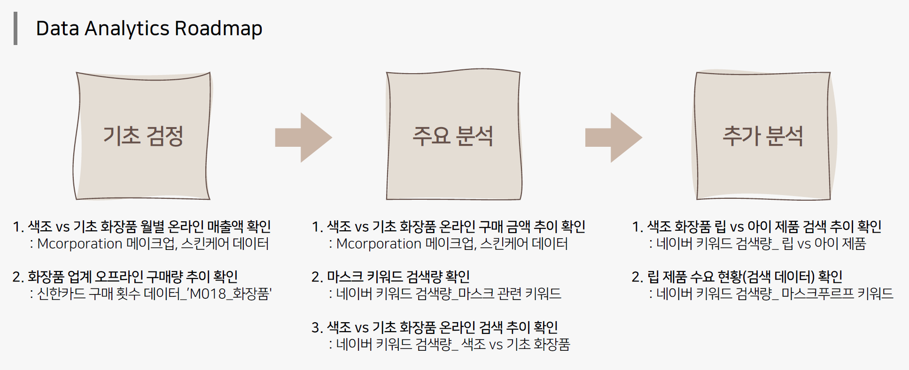
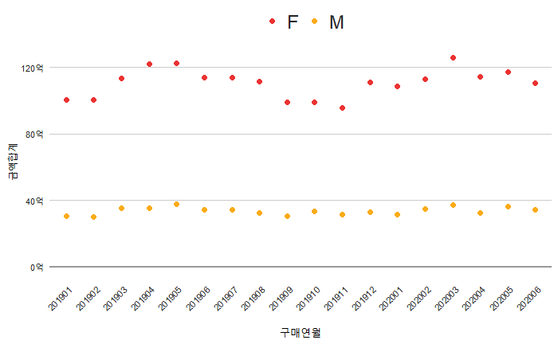
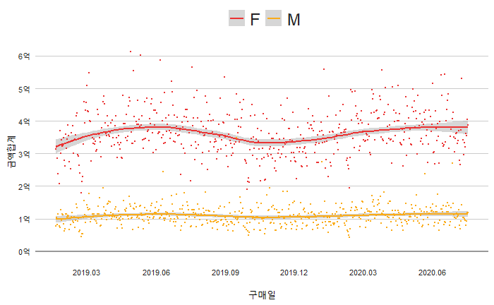
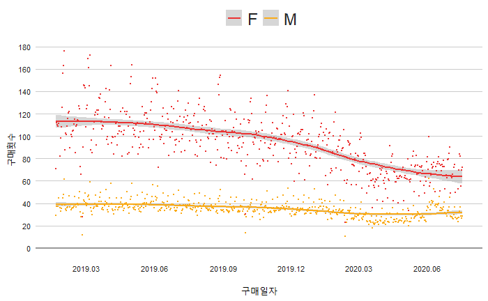
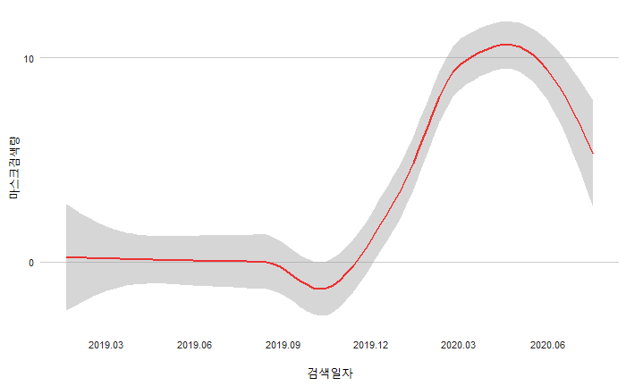
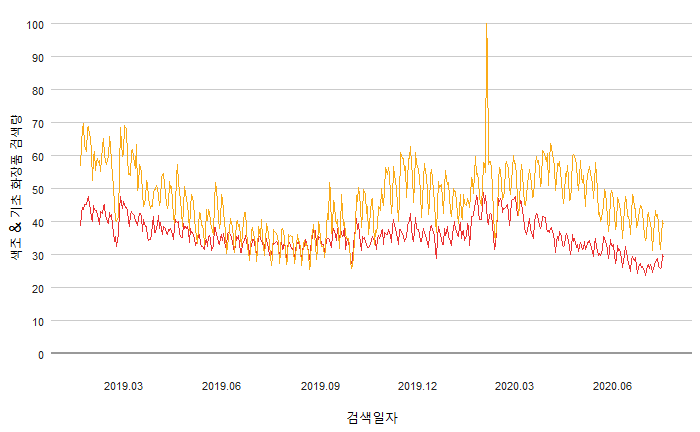
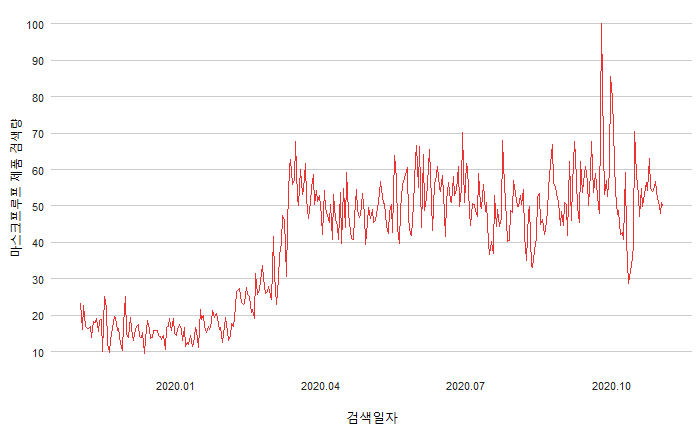

# KDX 소비트렌드 코리아2020  

  

+ KDX 유통·소비 데이터 분석 & 시각화 경진대회  
  - 일정: 2020.09.23 - 2020.10.25  
  - 주최 및 주관: MBN, KDX한국데이터거래소  
  - 후원: NIA 한국정보화진흥원  
  - 데이터 제공기업: 삼성카드, 신한카드, Gin+, MCorporation  

## 개요
### 1. 과제  
+ KDX의 다양한 데이터와 외부 데이터를 활용해  
한국의 소비 트렌드를 분석해 인사이트를 도출하고 이를 보기 좋게 시각화 해주세요.

### 2. 상세 설명  
+ KDX가 제공하는 다양한 소비 데이터(온라인 쇼핑, 오프라인 신용카드, 부동산 등)를 분석해주세요.  
+ 분석 결과는 참신한 아이디어와 창의력을 이용해 시각화 해주세요.  
+ 공공과 민간을 가리지 않고 많은 분야에 활용될 수 있는 결과가 나온다면 더욱 환영입니다.  

### 3. 평가 기준  
|   기준  항목  |                         내용                         |  
|---|---|  
| 인사이트 점수 | 인사이트 도출, 논리 명확성, 주제 선정과 분석 창의성  |  
|   기술 점수   | 분석 기술 수준                                       |  
|   실용 점수   | 대시보드 시장성과 품질                               |  

### 4. 규칙
+ 내부 분석환경에서 코드 저장 후 제출 페이지에서 제출  
  - 제공 분석환경: Python Jupyter Notebook, R studio)    
+ 제출 파일은 final_analysis (.rmd, .rmarkdown, .ipynb) 이름으로 저장  
+ 시각화된 자료는 캡쳐 또는 다운받아서 ppt로 대시보드 구성 > 제출 페이지 통해 제출  
+ 기획안 ppt는 pdf로 변환하여 제출 페이지에서 첨부 파일로 제출  
+ 대시보드는 5개 이상의 차트로 구성, 인사이트에 대한 설명 필요  

### 5. 시상 내역
+ 대상(1팀) 300만원  
+ 최우수상(1팀) 150만원  
+ 우수상(1팀) 100만원  
+ 장려상(2팀) 각 25만원  

### 6. 팀 구성
+ 작업툴: RStudio  
+ 인원: 3명  
+ 주요 업무: 코드 구현, PPT 제작  
+ 기간: 20.10.12 - 20.10.25  

+ 1. Subject
  - "코로나19 발생 이후 색조 및 기초 화장품 수요 비교분석"  
  - 코로나19로 인한 마스크 일상화/의무화 시대, 화장품 업계 매출 추이를 살펴보고 발전 방향 제언하기 

+ 2. Used Data
  - Mcorporation online purchase data    
  - Shinhancard offline purchase data  
  - Naver keyword serch data


## 소스코드 설명

### 데이터 분석 방향
  

### 1. 라이브러리 불러오기
```{r}
library(readxl)
library(dplyr)
library(tidyr)
library(reshape2)
library(ggplot2)
library(lubridate)
library(labeling)
library(extrafont)
```  

### 2. 시각화 테마 bbplot 패키지 설치하기
```{r}
if(!require(pacman))install.packages("pacman")

pacman::p_load('dplyr', 'tidyr', 'gapminder',
               'ggplot2',  'ggalt',
               'forcats', 'R.utils', 'png', 
               'grid', 'ggpubr', 'scales',
               'bbplot')

```  

### 3. Mcorporation

```{r}
# 64개 중, 사용할 데이터만 정리하기(메이크업, 스킨케어)
files <- list.files(path = "data/use", pattern = "*.xlsx", full.names = T)  
products <- sapply(files, read_excel, simplify = FALSE) %>% 
  bind_rows(.id = "id")

glimpse(products)
```

```{r}
# 전체 필터 넣기
filter_products <- group_by(products, 카테고리명, 구매날짜, 고객성별, 고객나이, 구매금액, 구매수) %>%
  separate(구매날짜, into = c("구매연월", "삭제(일자)"), sep = 6) %>%
  select(카테고리명, 구매연월, 고객성별, 고객나이, 구매금액, 구매수)
```

```{r}
# 성별&나이 결측치 제거하기(성별 F, M, 나이 0 이상만 추출)
nomiss_products <- filter_products %>%
  filter(!is.na(고객성별) & !is.na(고객나이)) %>%
  filter((고객성별 %in% c("F", "M")), 고객나이 > 0)
```

```{r}
# "메이크업 용품" 카테고리 추출
cosmetics <- filter(nomiss_products, 카테고리명 == "메이크업 용품")
```

```{r}
# 월별 데이터 합계_메이크업 용품
summarise_cosmetics <- cosmetics %>%
  group_by(구매연월, 고객성별) %>%
  summarise(금액합계 = sum(구매금액))
```

```{r}
# "스킨 케어" 카테코리 추출
skincare <- filter(nomiss_products, 카테고리명 == "스킨케어")
```

```{r}
# 월별 데이터 합계_스킨케어
summarise_skincare <- skincare %>%
  group_by(구매연월, 고객성별) %>%
  summarise(금액합계 = sum(구매금액))
```

```{r}
# 시각화하기
## '단위: 억' 적용
label_ko_num = function(num){
  ko_num = function(x){
    new_num = x %/% 100000000
    return(paste(new_num, '억', sep = ''))
  }
  return(sapply(num, ko_num))
}
```

```{r}
#색조 화장품(메이크업 용품)_월별 추이_ppt.12p
library(ggplot2)

graph_cosmetics <- ggplot(summarise_cosmetics, aes(x = 구매연월, y = 금액합계, color = 고객성별)) +
  geom_point(size = 2) +
  scale_y_continuous(labels = label_ko_num) +
theme(
      axis.text.x = element_text(size = 8,family= "NanumSquare_ac", hjust = 1, angle = 45),
    axis.text.y = element_text(size = 8,family = "NanumSquare_ac"),
    legend.position = "bottom",
    axis.title.x = element_text(size = 12, family = "NanumSquare_ac"),
    axis.title.y = element_text(size = 12, family = "NanumSquare_ac")) +
  geom_hline(yintercept = 0, size = 1, colour="#999999") +
  scale_colour_manual(values = c("#EB3232", "#FAAB18")) +
  bbc_style()

graph_cosmetics
```
  

```{r}
# 기초 화장품(스킨케어)_월별 추이_ppt.12p
graph_skincare <- ggplot(summarise_skincare, aes(x = 구매연월, y = 금액합계, color = 고객성별)) +
  geom_point(size = 2) +
  scale_y_continuous(labels = label_ko_num) +
  theme(
    axis.text.x = element_text(size = 8,family= "NanumSquare_ac",hjust = 1, angle = 45),
    axis.text.y = element_text(size = 8,family = "NanumSquare_ac"),
    legend.position = "bottom",
    axis.title.x = element_text(size = 12, family = "NanumSquare_ac"),
    axis.title.y = element_text(size = 12, family = "NanumSquare_ac")) +
  geom_hline(yintercept = 0, size = 1, colour="#999999") +
  scale_colour_manual(values = c("#EB3232", "#FAAB18")) +
  bbc_style()

graph_skincare
```
  

```{r}
# 성별&나이 결측치 제거하기(성별 F, M, 나이 0 이상만 추출)
nomiss_products <- products %>%
  filter(!is.na(고객성별) & !is.na(고객나이)) %>%
  filter((고객성별 %in% c("F", "M")), 고객나이 > 0) %>%
  select(카테고리명, 구매날짜, 고객성별, 고객나이, OS유형, 구매금액, 구매수)
```

```{r}
# 비교값 만들기
compare_products <- nomiss_products %>%
  group_by(카테고리명, 구매날짜, 고객성별) %>%
  summarise(금액합계 = sum(구매금액))
```

```{r}
# 문자형 데이터 -> 날짜 데이터로 전환
library(lubridate)

final_products <- compare_products %>%
  mutate(구매일 = ymd(구매날짜))
```

```{r}
# 색조화장품(메이크업 용품) 데이터 시각화 _ppt.14p

final_products

cosmetics <- final_products %>%
  filter(카테고리명 == "메이크업 용품")

font_import(pattern = "NanumSquare")

# loadfonts(device = "win")

theme_update(text = element_text(family = "NanumSquare_ac Bold"))

graph_cosmetics <- ggplot(cosmetics, aes(x = 구매일, y = 금액합계, color = 고객성별)) +
  geom_smooth() + geom_point(size = 0.1) +
  scale_y_continuous(labels = label_ko_num, breaks = seq(0, 2000000000, by = 250000000)) +
  scale_x_date(date_breaks="3 month", minor_breaks=NULL, date_labels = "%Y.%m") +
  theme(
    axis.text.x = element_text(size = 8,family= "NanumSquare_ac", hjust = 1),
    axis.text.y = element_text(size = 8,family = "NanumSquare_ac"),
    axis.title.x = element_text(size = 12, family = "NanumSquare_ac"),
    axis.title.y = element_text(size = 12, family = "NanumSquare_ac"),
  ) +
  geom_hline(yintercept = 0, size = 1, colour="#999999") +
  scale_colour_manual(values = c("#EB3232", "#FAAB18")) +
  bbc_style()

graph_cosmetics
```
  

```{r}
# 기초화장품(스킨케어) 데이터 시각화_ppt.14p
skincare <- final_products %>%
  filter(카테고리명 == "스킨케어")

font_import(pattern = "NanumSquare")

# loadfonts(device = "win")

theme_update(text = element_text(family = "NanumSquare_ac Bold"))

graph_skincare <- ggplot(skincare, aes(x = 구매일, y = 금액합계, color = 고객성별)) +
  geom_smooth() + geom_point(size = 0.1) +
  scale_y_continuous(labels = label_ko_num, breaks = seq(0, 600000000, by = 100000000)) +
  scale_x_date(date_breaks="3 month", minor_breaks=NULL, date_labels = "%Y.%m") +
  theme(
    axis.text.x = element_text(size = 8,family= "NanumSquare_ac", hjust = 1),
    axis.text.y = element_text(size = 8,family = "NanumSquare_ac"),
    axis.title.x = element_text(size = 12, family = "NanumSquare_ac"),
    axis.title.y = element_text(size = 12, family = "NanumSquare_ac"),
  ) +
  geom_hline(yintercept = 0, size = 1, colour="#999999") +
  scale_colour_manual(values = c("#EB3232", "#FAAB18")) +
  bbc_style()

graph_skincare
```
  


### 4. Shinhancard

```{r}
# 신한카드 오프라인 구매 데이터 결측치 제거
shinhancard <- shinhancard %>%
  select(-c(6:8))
```

```{r}
# 신한카드 데이터 필터링
filter_sh_beauty <- shinhancard %>%
  select(업종, 일별, 성별, 연령대별, '카드이용건수(천건)') %>%
  filter(업종 == "M018_화장품")
```

```{r}
# 신한카드 성별&나이 결측치 제거하기(성별 F, M, 나이 0 이상만 추출)
nomiss_sh_beauty <- filter_sh_beauty %>%
  filter(!is.na(성별) & !is.na(연령대별)) %>%
  filter((성별 %in% c("F", "M")), 연령대별 > 0)
```

```{r}
# 신한카드 '화장품' 카테고리 구매수 합계
sum_sh_beauty <- nomiss_sh_beauty %>%
  group_by(일별, 성별) %>%
  summarise('구매횟수' = sum(`카드이용건수(천건)`))
```

```{r}
# 신한카드 데이터 시계열 데이터로 변환
final_sh_beauty <- sum_sh_beauty %>%
  mutate(구매일자 = ymd(일별))
```

```{r}
# 신한카드 '화장품' 카테고리 구매수 합계
sum_sh_beauty <- nomiss_sh_beauty %>%
  group_by(일별, 성별) %>%
  summarise('구매횟수' = sum(`카드이용건수(천건)`))

sum_sh_beauty
```

```{r}
# 신한카드 데이터 시계열 데이터로 변환
final_sh_beauty <- sum_sh_beauty %>%
  mutate(구매일자 = ymd(일별))

final_sh_beauty
```

```{r}
# 신한카드 '화장품' 카테고리 데이터 시각화_ppt.13p
graph_sh_beauty <- ggplot(final_sh_beauty, aes(x = 구매일자, y = 구매횟수, color = 성별)) +
  geom_smooth() + geom_point(size = 0.1) +
  scale_x_date(date_breaks="3 month", minor_breaks=NULL, date_labels = "%Y.%m") +
  scale_y_continuous(breaks = seq(0, 200, by = 20)) +
  theme(
    axis.text.x = element_text(size = 8,family= "NanumSquare_ac", hjust = 1),
    axis.text.y = element_text(size = 8,family = "NanumSquare_ac"),
    axis.title.x = element_text(size = 12, family = "NanumSquare_ac"),
    axis.title.y = element_text(size = 12, family = "NanumSquare_ac"),
  ) +
  geom_hline(yintercept = 0, size = 1, colour="#999999") +
  scale_colour_manual(values = c("#EB3232", "#FAAB18")) +
  bbc_style()
   
graph_sh_beauty
```
  


### 5. 네이버 키워드 검색 데이터
#### 5.1 마스크  

```{r}
# 마스크 키워드 검색량 데이터 불러오기
mask <- read_excel("data/mask_keywords_data.xlsx")
```

```{r}
# 문자형 데이터를 숫자형으로 변환

mask$마스크검색량 <- as.numeric(mask$마스크검색량)
```

```{r}
# 문자형 데이터를 날짜형으로 변환
final_mask <- mask %>%
  mutate(검색일자 = ymd(구매날짜))

final_mask
```

```{r}
# 마스크 키워드 검색량 데이터 시각화_ppt.15p
graph_mask <- ggplot(final_mask, aes(x = 검색일자, y = 마스크검색량)) +
  geom_smooth(color = "#EB3232") +
  scale_y_continuous(breaks = seq(0, 100, by = 10)) +
  scale_x_date(date_breaks="3 month", minor_breaks=NULL, date_labels = "%Y.%m") +
  theme(
    axis.text.x = element_text(size = 8,family= "NanumSquare_ac",  hjust = 1),
    axis.text.y = element_text(size = 8,family = "NanumSquare_ac"),
    axis.title.x = element_text(size = 12, family = "NanumSquare_ac"),
    axis.title.y = element_text(size = 12, family = "NanumSquare_ac")) +
  bbc_style()
  
graph_mask
```
  

#### 5.2 기초 vs 색조 화장품   

```{r}
# (색조 & 기초) 화장품 키워드 검색량 데이터 불러오기
makeup <- read_excel("data/색조 vs 기초 화장품 키워드 검색량.xlsx")
```

```{r}
# 문자형 데이터를 숫자형으로 변환
makeup$색조화장품 <- as.numeric(makeup$색조화장품)
makeup$기초화장품 <- as.numeric(makeup$기초화장품)
```

```{r}
# 문자형 데이터를 날짜형으로 변환
trans_makeup <- makeup %>%
```

```{r}
# 색조 & 기초 메이크업 화장품 키워드 검색량 데이터 시각화_ppt.16p

graph_makeup <- ggplot(trans_makeup, aes(x = 검색일자, y = `색조 & 기초 화장품 검색량`)) +
  geom_line(aes(y = `색조화장품`), color = "#EB3232") + 
  geom_line(aes(y = `기초화장품`), color = "#FAAB18") +
  scale_y_continuous(breaks = seq(0, 100, by = 10)) +
  scale_x_date(date_breaks="3 month", minor_breaks = NULL, date_labels = "%Y.%m") +
  theme(
    axis.text.x = element_text(size = 8,family= "NanumSquare_ac", hjust = 1),
    axis.text.y = element_text(size = 8,family = "NanumSquare_ac"),
    axis.title.x = element_text(size = 12, family = "NanumSquare_ac"),
    axis.title.y = element_text(size = 12, family = "NanumSquare_ac")) +
  geom_hline(yintercept = 0, size = 1, colour="#999999") +
  bbc_style()

graph_makeup
```
  

#### 5.3 색조 중, 립 vs 아이 메이크업 키워드 데이터   

```{r}
# (립 & 아이) 화장품 키워드 검색량 데이터 불러오기
lipeye <- read_excel("data/메이크업 제품 비교(아이, 립).xlsx")
```

```{r}
# 문자형 데이터를 날짜형으로 변환
trans_lipeye <- lipeye %>%
  mutate(검색일자 = ymd(날짜))

trans_lipeye
```

```{r}
# 립 & 아이 메이크업 화장품 키워드 검색량 데이터 시각화_ppt.15p

graph_lipeye <- ggplot(trans_lipeye, aes(x = 검색일자, y = `립 & 아이 메이크업 검색량`)) +
  geom_line(aes(y = `립 메이크업`), color = "#EB3232") + 
  geom_line(aes(y = `아이 메이크업`), color = "#FAAB18") +
  scale_y_continuous(breaks = seq(0, 100, by = 10)) +
  scale_x_date(date_breaks="3 month", minor_breaks=NULL, date_labels = "%Y.%m") +
  theme(
    axis.text.x = element_text(size = 8,family= "NanumSquare_ac", hjust = 1),
    axis.text.y = element_text(size = 8,family = "NanumSquare_ac"),
    axis.title.x = element_text(size = 12, family = "NanumSquare_ac"),
    axis.title.y = element_text(size = 12, family = "NanumSquare_ac")) +
  geom_hline(yintercept = 0, size = 1, colour="#999999") +
  bbc_style()

graph_lipeye
```
  

#### 5.4 마스크프루프  

```{r}
# (마스크프루프) 화장품 키워드 검색량 데이터 불러오기
maskproof <- read_excel("data/마스크프루프 키워드 데이터.xlsx")
```

```{r}
# 문자형 데이터를 숫자형으로 변환
maskproof$마스크프루프 <- as.numeric(maskproof$마스크프루프)
```

```{r}
# 문자형 데이터를 날짜형으로 변환
trans_maskproof <- maskproof %>%
  mutate(검색일자 = ymd(날짜))
```
```{r}
# 마스크프루프 화장품 키워드 검색량 데이터 시각화

graph_maskproof <- ggplot(trans_maskproof, aes(x = 검색일자, y = `마스크프루프 제품 검색량`)) +
  geom_line(aes(y = `마스크프루프`), color = "#EB3232") +
  scale_y_continuous(breaks = seq(0, 100, by = 10)) +
  scale_x_date(date_breaks="3 month", minor_breaks=NULL, date_labels = "%Y.%m") +
  theme(
    axis.text.x = element_text(size = 8,family= "NanumSquare_ac", hjust = 1),
    axis.text.y = element_text(size = 8,family = "NanumSquare_ac"),
    axis.title.x = element_text(size = 12, family = "NanumSquare_ac"),
    axis.title.y = element_text(size = 12, family = "NanumSquare_ac")) +
  bbc_style()
  
graph_maskproof
```
